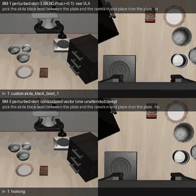
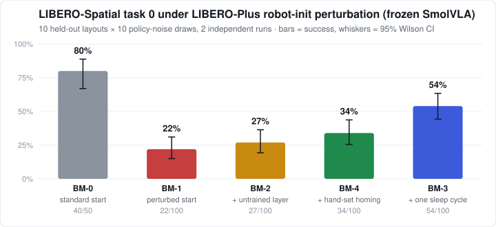
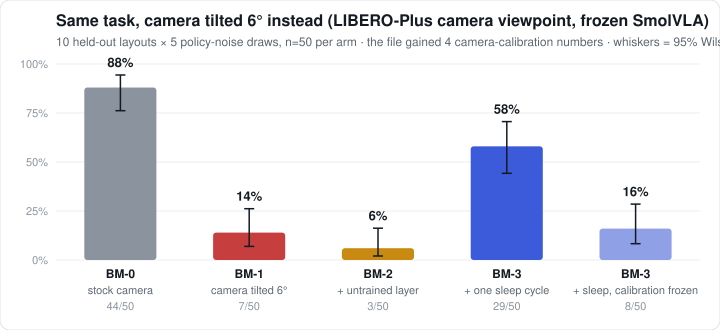
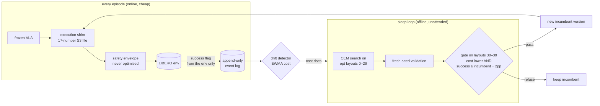

# Fleet Memory

**A frozen robot policy that gets better at its own environment while it sleeps.**

[](https://github.com/mzhao1599/dnhacks26/actions/workflows/ci.yml)


Vision-language-action models (here: [SmolVLA](https://huggingface.co/lerobot/smolvla_libero) on [LIBERO](https://github.com/Lifelong-Robot-Learning/LIBERO)) are brittle: shift the arm's starting joints by 0.1 rad — [LIBERO-Plus](https://github.com/sylvestf/LIBERO-plus)'s *robot-initial-state* perturbation — and success drops from **80% to 22%**. Fine-tuning is the usual answer. Fleet Memory instead leaves the weights alone and wraps the policy in an execution shim driven by a **21-number parameter file** (approach shaping, time scale, velocity cap, gripper command, a homing move, and a camera re-calibration of the frame the policy sees). An offline "sleep loop" searches that file with CEM on layouts it is allowed to see, and a gate on layouts it never sees decides whether the new version replaces the old one. No demonstrations, no gradients, no human in the loop.

<p align="center">
  <br>
  <sub>Same seed, same frozen policy. Top: perturbed start, raw VLA (fails). Bottom: after one unattended sleep cycle (succeeds).</sub>
</p>

## The result

<p align="center"></p>

| arm | what it is | success (n) | 95% CI |
|---|---|---|---|
| BM-0 | standard start, frozen VLA | **80%** (40/50) | [67, 89] |
| BM-1 | perturbed start, frozen VLA — *the collapse* | **22%** (33/150) | [16, 29] |
| BM-2 | perturbed + the shim with untrained defaults | 27% (40/150) | [20, 34] |
| BM-4 | perturbed + hand-set homing (a human typed the number) | 37% (55/150) | [29, 45] |
| **BM-3** | **perturbed + ONE unattended sleep cycle (v2)** | **54%** (54/100) | **[44, 64]** |
| **BM-3.2** | **a second unattended sleep cycle, 24-seed gate (v3)** | **70%** (35/50) | **[56, 81]** |

BM-3 vs BM-1: **2.45×** after one cycle, intervals disjoint, replicated across two independent 50-episode runs on 10 evaluation layouts the optimizer and the gate never saw; a second unattended cycle took it to **70%** on a third independent run (BM-1 on that run: 22% again). The optimizer found homing on its own *and* beat the human's hand-set version (54% vs 37%): its vector also slows the chunks (time scale 0.85, then 0.76), lowers the grasp by ~1.5 cm and narrows the approach cone. The mastery curve on the perturbed environment is **22% → 54% → 70%**, every step through the gate.

It does not always work, and the repo says so: on the harder task 3 (perturbation 0.2 rad) one sleep cycle came out exactly at baseline (27% → 27%, n=150) and the strong gate correctly refused a second one, and a 6 cm object shift is outside what this parameter file can express (recovery 0/15). Every number, with n and interval, is in **[`docs/RESULTS.md`](docs/RESULTS.md)**.

## Second perturbation family: the camera moves (added on the last day)

Same task, same frozen policy, and instead of the robot's start the **camera** is perturbed — LIBERO-Plus's *camera-viewpoint* family, ported exactly (`tests/test_camera.py` checks our poses against their code). Tilting the fixed camera's optical axis by 6° collapses SmolVLA as hard as the joint offset did. The action-side knobs cannot fix a moved camera, so the parameter file gained four *observation-side* numbers: roll, zoom and x/y shift of the external camera frame before the policy sees it — identity by default, optimised and gated exactly like the rest. The optimizer is never told the camera moved; it only sees cost.

<p align="center"></p>

| arm (task 0, view `0_0_100_2_354`, 10 held-out layouts × 5 noise draws) | success (n) | 95% CI |
|---|---|---|
| BM-0 stock camera, frozen VLA | **88%** (44/50) | [76, 94] |
| BM-1 camera tilted 6°, frozen VLA — *the collapse* | **14%** (7/50) | [7, 26] |
| BM-2 tilted + the shim with untrained defaults | 6% (3/50) | [2, 16] |
| **BM-3 tilted + ONE unattended sleep cycle (v2)** | **58%** (29/50) | **[44, 71]** |

BM-3 vs BM-1: **4.1×**, intervals disjoint. The promoted file moved the frame up and left by ~17% of its size with a 9% zoom and 2° roll — the direction that undoes the tilt — and also slowed the chunks (time scale 0.64). The gate saw 12.5% → 66.7% on its 24 layouts (cost 4.04 → 1.89). An attribution run with the four camera numbers frozen (17 action dims only) also passed its gate (20.8% → 33.3%) but did not hold up held-out: **16%** (8/50) against its own raw 8% — the recovery is the calibration's. As with the robot-start family, it does not rescue scenes the frozen policy can barely do: task 1 under its tilt is 6% raw → 8% after a sleep (n=50, the gate had passed on cost alone). **And the unattended loop closes end to end on this family:** with the camera tilted mid-run, the drift detector fired, the sleep ran on its own (568 rollouts, 32 min), the gate promoted a file that shifts the frame the same way, and the recovery stage came back to 73% from 20% — the pre-perturbation baseline was 67% (protocol P, n=15 per stage; details in RESULTS §8). A second sleep cycle on task 0 (half budget) found nothing better than v2 on fresh validation seeds and promoted nothing, which is the gate doing its job. Task 3 under its view moved 8% → 18% (n=50, intervals overlap: partial). Tasks 2/4 were still running at submission time; every row in [`docs/RESULTS.md` §8](docs/RESULTS.md) holds only measured numbers. **Proof:** [`docs/proof/camera_family/`](docs/proof/camera_family/) has the Slurm accounting, the raw job outputs, the evaluation event log, the same-seed videos, and `scripts/verify_camera.py`, which recounts every number from the raw episode records. A curiosity from the probe: physically *moving* the camera (11° around, 15° up, 30 cm) barely hurts this policy (6/10 vs 8/10 stock), while a 6° pointing tilt collapses it — the scene shifting in the frame is what breaks it, and that is what the shift dims undo.

## Proof the numbers are real

Every number above is recomputed from raw per-episode records written by the cluster jobs, and the records ship with the repo:

| | robot-start family | camera family |
|---|---|---|
| Slurm accounting (job ids, nodes, GPUs, times) | [`docs/proof/robot_init/sacct_2026-09-05.txt`](docs/proof/robot_init/sacct_2026-09-05.txt) | [`docs/proof/camera_family/sacct_2026-09-06.txt`](docs/proof/camera_family/sacct_2026-09-06.txt) |
| raw job stdout (the `REPS`/`CYCLE` lines) | [`docs/proof/robot_init/slurm_out/`](docs/proof/robot_init/slurm_out/) | [`docs/proof/camera_family/slurm_out/`](docs/proof/camera_family/slurm_out/) |
| per-episode event log (seed, arm, parameter file, simulator success flag) | [`events_evaluation.jsonl`](docs/proof/robot_init/events_evaluation.jsonl) | [`events_evaluation.jsonl`](docs/proof/camera_family/events_evaluation.jsonl) |
| recount from the raw records | `python scripts/verify_robot_init.py` → [output](docs/proof/robot_init/verify_output.txt) | `python scripts/verify_camera.py` → [output](docs/proof/camera_family/verify_output.txt) |
| same-seed videos | `logs/hopper/videos/` (storyboard) | [`cam_BM-1_s5047_fail.mp4`](docs/proof/camera_family/cam_BM-1_s5047_fail.mp4), [`cam_BM-3_s5047_ok.mp4`](docs/proof/camera_family/cam_BM-3_s5047_ok.mp4) |

The optimizer only ever runs on init states 0–29 and the gate on 30–39 (`fleet_memory/runner/seeds.json`); every evaluation episode
is on init states 40–49, which the verify scripts enforce by seed. Success is the simulator's predicate. The only field that differs
between the collapse arm and the recovered arm in those records is `s3_params`. Full logs (with every CEM rollout) are on the cluster:
`/scratch/ezhao2/fleet-memory/logs/`.

## How it works



* **The policy never changes.** Everything that changes is one versioned, gated parameter file per (skill, environment) — a `skill_instance` record in the log.
* **Success is the environment's predicate, nothing else.** No LLM ever decides whether an episode succeeded.
* **Three disjoint seed sets** (`fleet_memory/runner/seeds.json`): the optimizer sees layouts 0–29, the gate 30–39, the evaluation 40–49. The numbers above are all on 40–49.
* **The gate is the product.** Across the night it refused 7 of 13 candidate vectors; every refusal held up on later held-out evidence. The weak (12-seed) gate let two false positives through (both ≈ baseline at n=100); every decision of the strong gate (24 seeds × 4 draws) — two promotions, two refusals — held up. See `docs/RESULTS.md` "Gate tally".
* **An LLM coach exists but is optional** (Gemini or Claude, `agents/`): it writes discrete plans and lessons, may *propose* continuous values, and cannot apply them — only the optimizer's gate writes the S3 file. On this benchmark it contributed nothing measurable, and that is reported too.

The nine invariants the code is written against are in [`AGENTS.md`](AGENTS.md) (vendor-neutral) / [`CLAUDE.md`](CLAUDE.md).

## Run it in two minutes (laptop, no GPU)

Everything runs end-to-end on a mock environment and mock policy, offline:

```bash
git clone https://github.com/mzhao1599/dnhacks26 && cd dnhacks26
python3.12 -m venv .venv && source .venv/bin/activate && pip install -e ".[dev]"
FM_LLM=mock pytest -q                                            # 120 tests, ~15 s

# baseline -> one sleep cycle -> gated promotion -> results table
FM_LLM=mock python -m fleet_memory.runner.pool --env mock --policy mock --suite mock --task pick_bowl_to_plate \
    --arm A --n 40 --workers 4 --seed-set train --log logs/v3.jsonl --make-reference
FM_LLM=mock python -m fleet_memory.runner.consolidate --env mock --policy mock --suite mock \
    --task pick_bowl_to_plate --log logs/v3.jsonl --small --trigger manual
python -m fleet_memory.analysis.metrics --log logs/v3.jsonl

# the whole story unattended: perturb -> drift fires -> sleep -> recover
FM_LLM=mock python -m fleet_memory.runner.pool --env mock --policy mock --suite mock --task pick_bowl_to_plate \
    --arm B --protocol P --n-stage 20 --perturb '{"shift_xy":[0.06,0]}' --log logs/p.jsonl
```

Then open `dashboard/index.html` and drop the `.jsonl` on it: mastery curve, per-environment "house model", version history, every gate decision.

## Reproduce the real numbers (GPU)

`pip install -e ".[sim]"` (lerobot 0.6.1 with SmolVLA + LIBERO), then the same commands with `--env libero --policy smolvla --suite libero_spatial --task 0`, and for the perturbation benchmark:

```bash
FM_LIBERO_PLUS=/path/to/LIBERO-plus FM_POLICY_KWARGS='{"n_action_steps":10}' \
python -m fleet_memory.runner.benchmark --policy smolvla --suite libero_spatial --tasks 0 \
    --dimension robot_init --arms BM-0,BM-1,BM-2,BM-4 --consolidate small --n-per-task 10 --workers 4 \
    --log logs/benchmark/events.jsonl            # adds BM-3 after one sleep cycle
python scripts/exp/bm_reps.py 0 5 --bm0          # the n=50 held-out x noise-draw version
```

Our runs were on GMU Hopper (one A100 40 GB; ~50 ms per control step with 10-action chunks). `scripts/hopper/` has the sbatch files and an autonomous task queue (`queue_runner.sh`) that kept the GPUs full overnight; `docs/HANDOFF.md` is the resume checklist for a fresh agent or human.

## Demo assets

* `dashboard/demo_artifact.html` — self-contained storyboard (clips inlined; open it anywhere), built by `scripts/build_demo_page.py`.
* `logs/hopper/videos/*.mp4` — same-seed clips per arm (`scripts/exp/record_demo.py`), agentview + wrist camera with the active S3 values overlaid.
* `docs/media/` — the README chart (`scripts/build_readme_media.py`) and GIF (ffmpeg, two clips stacked).
* Refresh after new runs: `bash scripts/pull_logs.sh && python scripts/build_demo_page.py && python scripts/build_dashboard_artifact.py`.

## Repository layout

```
fleet_memory/
  envs/        Env protocol; LIBERO, LIBERO-Plus (7 perturbation families), mock; perturbations
  policies/    Policy protocol; SmolVLA (lerobot), π₀.₅ stub, scripted IK fallback, mock
  execution/   the shim, the 17-dim S3 vector (params.py), homing, the immutable safety envelope, detectors
  memory/      schema.py (every record type), append-only store, retrieval, lesson A/B gate, drift, house model
  agents/      planner + inner/outer coach (LLM), llm.py (anthropic | gemini | offline mock)
  runner/      worker, persistent pool, arms A/B/C/D/P + BM-0..4, consolidate.py (CEM + validation + gate), seeds.json
  analysis/    cost function, metrics tables, plots
dashboard/     index.html (static, reads a .jsonl), demo storyboard
scripts/       exp/ (experiment drivers), hopper/ (cluster + queue), demo builders
tests/         120 tests, all on the mock stack
docs/          RESULTS.md (measured), DECISIONS.md (why), HANDOFF.md (resume)
```

## Honesty lines

* Base numbers are ours (SmolVLA, 10-action chunks) on LIBERO-Plus's exact robot-init perturbation; they are not the LIBERO-Plus paper's π₀/OpenVLA table.
* The shim reads object poses from simulator state, standing in for a detector. Homing runs in end-effector space (LIBERO's action interface), so it cannot restore the joint configuration itself.
* LIBERO has no force sensor; the cost's `force_proxy` is an action-magnitude proxy.
* n=100 per arm on one task is enough for the headline interval; it is one task and one policy, now under two perturbation families (robot start, camera).

## Credits

Built at [DN Hacks 2026](https://github.com/mzhao1599/dnhacks26) on top of [LIBERO](https://github.com/Lifelong-Robot-Learning/LIBERO), [LIBERO-Plus](https://github.com/sylvestf/LIBERO-plus) (Fei et al., arXiv 2510.13626), and [LeRobot](https://github.com/huggingface/lerobot)'s SmolVLA. MIT licensed.
