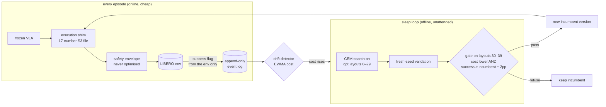

# Fleet Memory

**A frozen robot policy that gets better at its own environment while it sleeps.**

[](https://github.com/mzhao1599/dnhacks26/actions/workflows/ci.yml)


Vision-language-action models (here: [SmolVLA](https://huggingface.co/lerobot/smolvla_libero) on [LIBERO](https://github.com/Lifelong-Robot-Learning/LIBERO)) are brittle: shift the arm's starting joints by 0.1 rad — [LIBERO-Plus](https://github.com/sylvestf/LIBERO-plus)'s *robot-initial-state* perturbation — and success drops from **80% to 22%**. Fine-tuning is the usual answer. Fleet Memory instead leaves the weights alone and wraps the policy in an execution shim driven by a **17-number parameter file** (approach shaping, time scale, velocity cap, gripper command, a homing move). An offline "sleep loop" searches that file with CEM on layouts it is allowed to see, and a gate on layouts it never sees decides whether the new version replaces the old one. No demonstrations, no gradients, no human in the loop.

<p align="center">
  <br>
  <sub>Same seed, same frozen policy. Top: perturbed start, raw VLA (fails). Bottom: after one unattended sleep cycle (succeeds).</sub>
</p>

## The result

<p align="center"></p>

| arm | what it is | success (n) | 95% CI |
|---|---|---|---|
| BM-0 | standard start, frozen VLA | **80%** (40/50) | [67, 89] |
| BM-1 | perturbed start, frozen VLA — *the collapse* | **22%** (22/100) | [15, 31] |
| BM-2 | perturbed + the shim with untrained defaults | 27% (27/100) | [19, 36] |
| BM-4 | perturbed + hand-set homing (a human typed the number) | 34% (34/100) | [25, 44] |
| **BM-3** | **perturbed + ONE unattended sleep cycle** | **54%** (54/100) | **[44, 64]** |

BM-3 vs BM-1: **2.45×**, intervals disjoint, replicated across two independent 50-episode runs on 10 evaluation layouts the optimizer and the gate never saw. The optimizer found homing on its own *and* beat the human's hand-set version (54% vs 34%): its vector also slows the chunks (time scale 0.85), lowers the grasp by 1.8 cm and narrows the approach cone.

It does not always work, and the repo says so: on the harder task 3 (perturbation 0.2 rad) one sleep cycle came out ≈ baseline (30% → 26%, n=100), and a 6 cm object shift is outside what this parameter file can express (recovery 0/15). Every number, with n and interval, is in **[`docs/RESULTS.md`](docs/RESULTS.md)**.

## How it works



* **The policy never changes.** Everything that changes is one versioned, gated parameter file per (skill, environment) — a `skill_instance` record in the log.
* **Success is the environment's predicate, nothing else.** No LLM ever decides whether an episode succeeded.
* **Three disjoint seed sets** (`fleet_memory/runner/seeds.json`): the optimizer sees layouts 0–29, the gate 30–39, the evaluation 40–49. The numbers above are all on 40–49.
* **The gate is the product.** Across the night it refused 7 of 11 candidate vectors; every refusal held up on later held-out evidence. The weak (12-seed) gate let two false positives through; the strong gate (24 seeds × 4 draws) has let none through. See `docs/RESULTS.md` "Gate tally".
* **An LLM coach exists but is optional** (Gemini or Claude, `agents/`): it writes discrete plans and lessons, may *propose* continuous values, and cannot apply them — only the optimizer's gate writes the S3 file. On this benchmark it contributed nothing measurable, and that is reported too.

The nine invariants the code is written against are in [`AGENTS.md`](AGENTS.md) (vendor-neutral) / [`CLAUDE.md`](CLAUDE.md).

## Run it in two minutes (laptop, no GPU)

Everything runs end-to-end on a mock environment and mock policy, offline:

```bash
git clone https://github.com/mzhao1599/dnhacks26 && cd dnhacks26
python3.12 -m venv .venv && source .venv/bin/activate && pip install -e ".[dev]"
FM_LLM=mock pytest -q                                            # 120 tests, ~15 s

# baseline -> one sleep cycle -> gated promotion -> results table
FM_LLM=mock python -m fleet_memory.runner.pool --env mock --policy mock --suite mock --task pick_bowl_to_plate \
    --arm A --n 40 --workers 4 --seed-set train --log logs/v3.jsonl --make-reference
FM_LLM=mock python -m fleet_memory.runner.consolidate --env mock --policy mock --suite mock \
    --task pick_bowl_to_plate --log logs/v3.jsonl --small --trigger manual
python -m fleet_memory.analysis.metrics --log logs/v3.jsonl

# the whole story unattended: perturb -> drift fires -> sleep -> recover
FM_LLM=mock python -m fleet_memory.runner.pool --env mock --policy mock --suite mock --task pick_bowl_to_plate \
    --arm B --protocol P --n-stage 20 --perturb '{"shift_xy":[0.06,0]}' --log logs/p.jsonl
```

Then open `dashboard/index.html` and drop the `.jsonl` on it: mastery curve, per-environment "house model", version history, every gate decision.

## Reproduce the real numbers (GPU)

`pip install -e ".[sim]"` (lerobot 0.6.1 with SmolVLA + LIBERO), then the same commands with `--env libero --policy smolvla --suite libero_spatial --task 0`, and for the perturbation benchmark:

```bash
FM_LIBERO_PLUS=/path/to/LIBERO-plus FM_POLICY_KWARGS='{"n_action_steps":10}' \
python -m fleet_memory.runner.benchmark --policy smolvla --suite libero_spatial --tasks 0 \
    --dimension robot_init --arms BM-0,BM-1,BM-2,BM-4 --consolidate small --n-per-task 10 --workers 4 \
    --log logs/benchmark/events.jsonl            # adds BM-3 after one sleep cycle
python scripts/exp/bm_reps.py 0 5 --bm0          # the n=50 held-out x noise-draw version
```

Our runs were on GMU Hopper (one A100 40 GB; ~50 ms per control step with 10-action chunks). `scripts/hopper/` has the sbatch files and an autonomous task queue (`queue_runner.sh`) that kept the GPUs full overnight; `docs/HANDOFF.md` is the resume checklist for a fresh agent or human.

## Demo assets

* `dashboard/demo_artifact.html` — self-contained storyboard (clips inlined; open it anywhere), built by `scripts/build_demo_page.py`.
* `logs/hopper/videos/*.mp4` — same-seed clips per arm (`scripts/exp/record_demo.py`), agentview + wrist camera with the active S3 values overlaid.
* `docs/media/` — the README chart (`scripts/build_readme_media.py`) and GIF (ffmpeg, two clips stacked).
* Refresh after new runs: `bash scripts/pull_logs.sh && python scripts/build_demo_page.py && python scripts/build_dashboard_artifact.py`.

## Repository layout

```
fleet_memory/
  envs/        Env protocol; LIBERO, LIBERO-Plus (7 perturbation families), mock; perturbations
  policies/    Policy protocol; SmolVLA (lerobot), π₀.₅ stub, scripted IK fallback, mock
  execution/   the shim, the 17-dim S3 vector (params.py), homing, the immutable safety envelope, detectors
  memory/      schema.py (every record type), append-only store, retrieval, lesson A/B gate, drift, house model
  agents/      planner + inner/outer coach (LLM), llm.py (anthropic | gemini | offline mock)
  runner/      worker, persistent pool, arms A/B/C/D/P + BM-0..4, consolidate.py (CEM + validation + gate), seeds.json
  analysis/    cost function, metrics tables, plots
dashboard/     index.html (static, reads a .jsonl), demo storyboard
scripts/       exp/ (experiment drivers), hopper/ (cluster + queue), demo builders
tests/         120 tests, all on the mock stack
docs/          RESULTS.md (measured), DECISIONS.md (why), HANDOFF.md (resume)
```

## Honesty lines

* Base numbers are ours (SmolVLA, 10-action chunks) on LIBERO-Plus's exact robot-init perturbation; they are not the LIBERO-Plus paper's π₀/OpenVLA table.
* The shim reads object poses from simulator state, standing in for a detector. Homing runs in end-effector space (LIBERO's action interface), so it cannot restore the joint configuration itself.
* LIBERO has no force sensor; the cost's `force_proxy` is an action-magnitude proxy.
* n=100 per arm on one task is enough for the headline interval; it is one task, one perturbation family, one policy.

## Credits

Built at [DN Hacks 2026](https://github.com/mzhao1599/dnhacks26) on top of [LIBERO](https://github.com/Lifelong-Robot-Learning/LIBERO), [LIBERO-Plus](https://github.com/sylvestf/LIBERO-plus) (Fei et al., arXiv 2510.13626), and [LeRobot](https://github.com/huggingface/lerobot)'s SmolVLA. MIT licensed.
