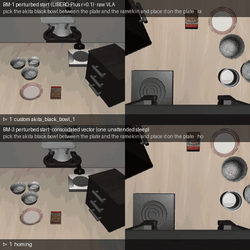
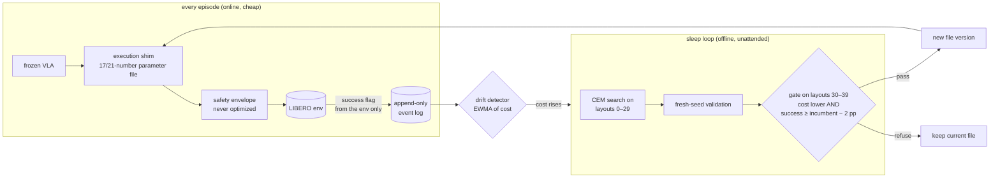
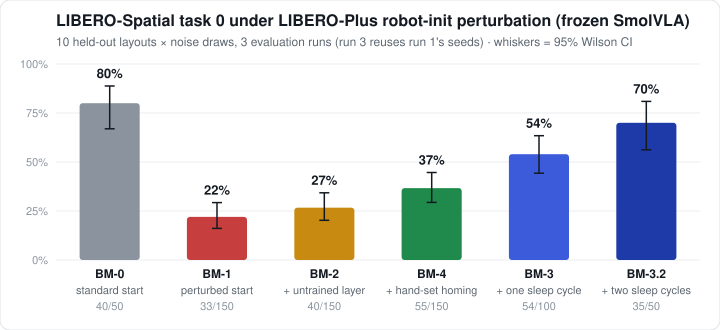
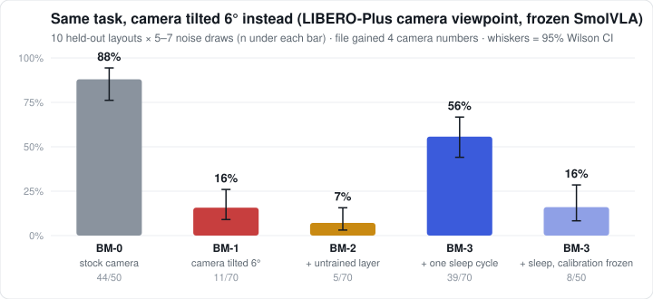

# Somnio Robotics

**Somnio (DN Hacks 2026) keeps a robot's vision-language-action policy frozen and adapts it to a changed scene by tuning a 17–21-number parameter file offline, in unattended "sleep" cycles.**

[](https://github.com/mzhao1599/dnhacks26/actions/workflows/ci.yml)


<p align="center">
  
  <br><sub>Same layout, same seed, same frozen SmolVLA. Top: arm start perturbed, raw policy times out at 220 steps. Bottom: after one unattended sleep cycle, success in 94 steps.</sub>
</p>

**Result.** Shift the arm's starting joints by 0.1 rad and a frozen [SmolVLA](https://huggingface.co/HuggingFaceVLA/smolvla_libero) policy drops from **80% to 22%** success on a LIBERO pick-and-place task. One unattended sleep cycle brings it back to **54%**, and a second to **70%**, on 10 held-out layouts that neither the optimizer nor the promotion gate ever saw. Tilt the camera 6° instead and success drops from **88% to 14%**; one sleep cycle brings it back to **58%** (n=50 each). The per-episode records behind every number are committed, and two scripts recount them.

**What is different**

- **The policy's weights never change.** No fine-tuning, demonstrations, gradients or human labels. The search is scored only by simulator outputs: success, step count, smoothness and action size.
- **What adapts is a small, versioned parameter file**: timing, a speed cap, the gripper close command, a scripted homing move, approach shaping and, for the camera case, a re-framing of the image the policy sees. It is 17 numbers for the robot-start results and 21 after four camera numbers were added.
- **A gate decides every change.** The optimizer searches on one set of layouts; a candidate replaces the current file only if it lowers cost without losing success on a second set; results are reported on a third. The gate and a fresh-seed check stopped several cycles, and the cases where sleep did *not* help are reported below.

Built at DN Hacks 2026 on LIBERO / LIBERO-Plus in simulation (no physical robot), with runs on a university GPU cluster.

## How it works


```mermaid
flowchart LR
  subgraph episode["every episode (online, cheap)"]
    P[frozen VLA] --> S[execution shim<br/>17/21-number parameter file] --> E[safety envelope<br/>never optimized] --> Env[(LIBERO env)]
    Env -->|success flag<br/>from the env only| L[(append-only<br/>event log)]
  end
  L --> D{drift detector<br/>EWMA of cost}
  D -->|cost rises| Sleep
  subgraph Sleep["sleep loop (offline, unattended)"]
    C[CEM search on<br/>layouts 0–29] --> V[fresh-seed validation] --> G{gate on layouts 30–39<br/>cost lower AND<br/>success ≥ incumbent − 2 pp}
  end
  G -->|pass| I[new file version] --> S
  G -->|refuse| K[keep current file]
```

- **The policy never changes.** Each (skill, environment) pair has one versioned, gated parameter file (`fleet_memory/execution/params.py`). The shim applies it around the policy's action chunks; an immutable safety envelope clips everything after that.
- **Sleep** is a cross-entropy-method (CEM) search over the file, scored by a cost that combines steps, jerk, an action-magnitude force proxy and failure (`fleet_memory/analysis/cost.py`). All candidates in an iteration share seeds, and the final pick is re-checked on fresh seeds before it reaches the gate (`fleet_memory/runner/consolidate.py`).
- **Three disjoint layout sets** (`fleet_memory/runner/seeds.json`): the optimizer uses LIBERO initial states 0–29, the gate 30–39, and every reported evaluation 40–49.
- **Drift detection** watches an EWMA of episode cost and can start a sleep cycle by itself (`--auto-sleep`).
- **An LLM coach is optional** (Gemini or Claude, `fleet_memory/agents/`). It can propose values but cannot apply them; only the gate writes the file. Adding it on top of the optimized file did not change results (n=20); its effect on its own was not measured cleanly.

The design rules the code follows are in [`AGENTS.md`](AGENTS.md); the reasoning behind them is in [`docs/DECISIONS.md`](docs/DECISIONS.md).

## Results

All on LIBERO-Spatial with frozen SmolVLA (10-action chunks). Evaluation = the 10 held-out layouts × policy-noise draws; 95% Wilson intervals. Arm codes (BM-0 to BM-4) match `docs/RESULTS.md`. Full tables, including every failure, are in [`docs/RESULTS.md`](docs/RESULTS.md).

### Robot-start perturbation (LIBERO-Plus robot-initial-state, 0.1 rad, task 0)

<p align="center"></p>

| arm | what runs | success (n) | 95% CI |
|---|---|---|---|
| BM-0 | standard start, frozen VLA | **80%** (40/50) | [67, 89] |
| BM-1 | perturbed start, frozen VLA: *the collapse* | **22%** (33/150) | [16, 29] |
| BM-2 | perturbed + the shim with its default (identity) file | 27% (40/150) | [20, 34] |
| BM-4 | perturbed + a homing move a human set by hand | 37% (55/150) | [29, 45] |
| **BM-3** | **perturbed + file from ONE unattended sleep cycle (v2)** | **54%** (54/100) | **[44, 63]** |
| **BM-3.2** | **after a second unattended sleep cycle (v3)** | **70%** (35/50) | **[56, 81]** |

- v2 is 2.45× the collapse, with disjoint intervals, over two evaluation runs with different noise draws (25/50 and 29/50).
- A second, independent sleep cycle with a wider search reached 40% (60/150).
- v3 was evaluated on the same seeds as the first run, where v2 had scored 25/50, so 35/50 is a same-seed comparison rather than a third independent sample.
- The optimizer found the homing move on its own and beat the hand-set version (54% vs 37%). v2 = homing with learned offsets, time scale 0.85 and a velocity cap of 0.96. v3 slowed the chunks further (0.76), turned on approach shaping, and lowered the grasp by 1.3 cm.

**Where it did not work.** On task 3 (a 0.2 rad perturbation) one sleep cycle came out exactly at baseline (27% → 27%, n=150), and a second cycle with the stronger gate stopped at fresh-seed validation without promoting anything. Tasks 1, 2 and 4 did not recover. A 6 cm object shift is outside what the file can express (0/15 after sleep).

### Camera perturbation (LIBERO-Plus camera viewpoint, 6° tilt, task 0)

The action-side numbers cannot fix a moved camera, so the file gained four observation-side numbers (roll, zoom, x/y shift of the image before the policy sees it; identity by default), optimized and gated like the rest. The optimizer is never told the camera moved.

<p align="center"></p>

| arm (view `0_0_100_2_354`) | success (n) | 95% CI |
|---|---|---|
| BM-0 stock camera, frozen VLA | **88%** (44/50) | [76, 94] |
| BM-1 camera tilted 6°, frozen VLA: *the collapse* | **14%** (7/50) | [7, 26] |
| BM-2 tilted + default file | 6% (3/50) | [2, 16] |
| **BM-3 tilted + ONE unattended sleep cycle (v2)** | **58%** (29/50) | **[44, 71]** |

- 4.1× the collapse, intervals disjoint. Two more noise draws gave 10/20 vs 4/20; pooled over n=70 it is 56% vs 16% (the chart shows the pooled bars).
- The promoted file moves the frame up and left by about 17% of its size, zooms 9% and rolls 2°, which is the direction that undoes the tilt.
- **The recovery comes from the calibration.** With the four camera numbers frozen, sleep also passed its gate but reached only 16% held-out (8/50 in the job output; 7/49 in the committed records, where one record was torn), against 8% raw.
- **The unattended loop closes end to end.** With the camera tilted mid-run, the drift detector fired, sleep ran by itself (568 rollouts, 32 min), and the gate promoted a file that shifts the frame the same way. Success was 10/15 before the tilt, 5/15 over the whole tilted stage (2/10 before the sleep finished), and 11/15 after.
- Task 3 moved from 8% to 18% (n=50, intervals overlap). Task 1 did not recover (6% → 8%). Tasks 2 and 4 were cancelled before they finished.
- A probe found that physically *moving* the camera (11° around, 15° up, 30 cm) barely hurts this policy (6/10 vs 8/10 stock), while a 6° pointing tilt collapses it. The scene shifting in the frame is what breaks it, and that is what the shift numbers undo.

### The gate

In the committed robot-start records (including the wide-search cycle, which `verify_robot_init.py` lists under the BM-3 rows), 11 sleep cycles ended: 5 promoted a new version, 3 were refused by the gate, and 3 stopped at fresh-seed validation. The first gate used 12 rollouts. Its promotions on tasks 2 and 3 and on a LIBERO-10 "mastery" run (RESULTS §3) turned out no better, or worse, held-out, so later cycles used a 24-rollout gate. The gate always runs on layouts 30–39.

## Raw records and recount

Every number above is recounted from raw per-episode records written by the cluster jobs, and those records are in the repo:

| | robot-start family | camera family |
|---|---|---|
| Slurm accounting (job ids, nodes, GPUs, times) | [`sacct_2026-09-05.txt`](docs/proof/robot_init/sacct_2026-09-05.txt) | [`sacct_2026-09-06.txt`](docs/proof/camera_family/sacct_2026-09-06.txt) |
| raw job stdout | [`slurm_out/`](docs/proof/robot_init/slurm_out/) | [`slurm_out/`](docs/proof/camera_family/slurm_out/) |
| per-episode event log (seed, arm, parameter file, simulator success flag) | [`events_evaluation.jsonl`](docs/proof/robot_init/events_evaluation.jsonl) | [`events_evaluation.jsonl`](docs/proof/camera_family/events_evaluation.jsonl) |
| recount | `python scripts/verify_robot_init.py` → [output](docs/proof/robot_init/verify_output.txt) | `python scripts/verify_camera.py` → [output](docs/proof/camera_family/verify_output.txt) |
| same-seed videos | [`logs/hopper/videos/`](logs/hopper/videos/) | [`cam_BM-1_s5047_fail.mp4`](docs/proof/camera_family/cam_BM-1_s5047_fail.mp4), [`cam_BM-3_s5047_ok.mp4`](docs/proof/camera_family/cam_BM-3_s5047_ok.mp4) |

The verify scripts need only the Python standard library and run from a fresh clone. The optimizer only ever runs on initial states 0–29 and the gate on 30–39; every evaluation episode is on 40–49, which the scripts enforce by seed. Success is the simulator's predicate. Between the collapse arm and the recovered arm, the only input that differs in those records is the parameter file (`s3_params`). The full logs, with every CEM rollout, stayed on the cluster.

## Run it in two minutes (laptop, no GPU)

Everything runs end to end on a mock environment and mock policy, offline:

```bash
git clone https://github.com/mzhao1599/dnhacks26 && cd dnhacks26
python3.12 -m venv .venv && source .venv/bin/activate && pip install -e ".[dev]"
FM_LLM=mock pytest -q                                            # 143 tests, about a minute

# baseline -> one sleep cycle -> gated promotion -> results table
FM_LLM=mock python -m fleet_memory.runner.pool --env mock --policy mock --suite mock --task pick_bowl_to_plate \
    --arm A --n 40 --workers 4 --seed-set train --log logs/v3.jsonl --make-reference
FM_LLM=mock python -m fleet_memory.runner.consolidate --env mock --policy mock --suite mock \
    --task pick_bowl_to_plate --log logs/v3.jsonl --small --trigger manual
python -m fleet_memory.analysis.metrics --log logs/v3.jsonl

# the unattended loop: baseline -> perturb -> drift fires -> sleep runs on its own -> recovery stage
FM_LLM=mock python -m fleet_memory.runner.pool --env mock --policy mock --suite mock --task pick_bowl_to_plate \
    --arm P --protocol P --n-stage 20 --perturb '{"shift_xy":[0.06,0]}' --auto-sleep --log logs/v3.jsonl
```

The mock environment only exercises the mechanics; its success rates mean nothing. Open `dashboard/index.html` and drop a `.jsonl` log on it to see the mastery curve, per-environment model, version history and every gate decision.

## Reproduce the real numbers (GPU)

`pip install -e ".[sim]"` (lerobot 0.6.1 with SmolVLA and LIBERO), then the same commands with `--env libero --policy smolvla --suite libero_spatial --task 0`. For the perturbation benchmark:

```bash
FM_LIBERO_PLUS=/path/to/LIBERO-plus FM_POLICY_KWARGS='{"n_action_steps":10}' \
python -m fleet_memory.runner.benchmark --policy smolvla --suite libero_spatial --tasks 0 \
    --dimension robot_init --arms BM-0,BM-1,BM-2,BM-4 --consolidate small --n-per-task 10 --workers 4 \
    --log logs/benchmark/events.jsonl            # adds BM-3 after one sleep cycle
python scripts/exp/bm_reps.py 0 5 --bm0          # the n=50 held-out × noise-draw version
```

The runs used George Mason's Hopper cluster: A100 40 GB and 80 GB nodes, MIG slices and CPU nodes (about 50 ms per control step on an A100 with 10-action chunks). `scripts/hopper/` has the sbatch files and the task queue (`queue_runner.sh`) that kept the GPUs busy overnight; `scripts/exp/camera_cycle.py` drives the camera family.

## Demo assets

- `dashboard/demo_artifact.html`: self-contained storyboard with the clips inlined (open it anywhere), built by `scripts/build_demo_page.py`.
- `logs/hopper/videos/*.mp4`: same-seed clips per arm (`scripts/exp/record_demo.py`), agent-view and wrist cameras with the arm label and outcome overlaid.
- `docs/media/`: the README charts (`scripts/build_readme_media.py`) and GIFs (ffmpeg, two clips stacked).

## Repository layout

```
fleet_memory/
  envs/        Env protocol; LIBERO, LIBERO-Plus (robot-init and camera-viewpoint families), mock; perturbations
  policies/    Policy protocol; SmolVLA (lerobot), π₀.₅ adapter (unverified), scripted IK fallback, mock
  execution/   the shim, the parameter file (params.py), homing, camera re-framing (calib.py), safety envelope, detectors
  memory/      record schema, append-only store, retrieval, drift detector, per-environment model
  agents/      optional LLM planner and coach (anthropic | gemini | offline mock)
  runner/      worker, persistent pool, arms and protocols, consolidate.py (CEM + validation + gate), seeds.json
  analysis/    cost function, metrics tables, plots
dashboard/     index.html (static, reads a .jsonl), demo storyboard
scripts/       exp/ (experiment drivers), hopper/ (cluster + queue), verify_*.py, demo builders
tests/         143 tests, all on the mock stack
docs/          RESULTS.md (measured), DECISIONS.md (why), HANDOFF.md (cluster runbook), proof/ (raw records)
```

The package is still named `fleet_memory`, the project's working name before the rename.

## Limitations

- **Simulation only.** One policy (SmolVLA), one benchmark suite (LIBERO-Spatial), two perturbation families. The strong results are on task 0; other tasks recovered partly or not at all.
- The shim reads object poses from simulator state, standing in for a detector. Homing runs in end-effector space (LIBERO's action interface), so it cannot restore the joint configuration itself.
- LIBERO has no force sensor; the cost's force term is an action-magnitude proxy.
- The base numbers are ours (SmolVLA, 10-action chunks) on LIBERO-Plus's exact perturbations. They are not the LIBERO-Plus paper's π₀ / OpenVLA table.
- Sample sizes are n=50 to 150 per arm: enough to separate the headline intervals, not to rank small differences.

## Credits

Built at DN Hacks 2026. Code, experiments and write-up by Max Zhao ([@mzhao1599](https://github.com/mzhao1599)); team members [@michael-wang0605](https://github.com/michael-wang0605) and [@calebynhan](https://github.com/calebynhan). Uses [LIBERO](https://github.com/Lifelong-Robot-Learning/LIBERO), [LIBERO-Plus](https://github.com/sylvestf/LIBERO-plus) (Fei et al., arXiv 2510.13626) and [LeRobot](https://github.com/huggingface/lerobot)'s SmolVLA. MIT licensed.
